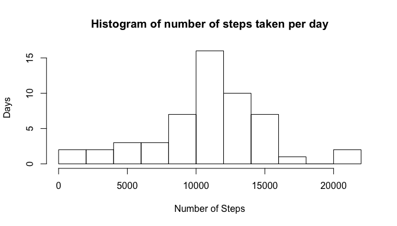
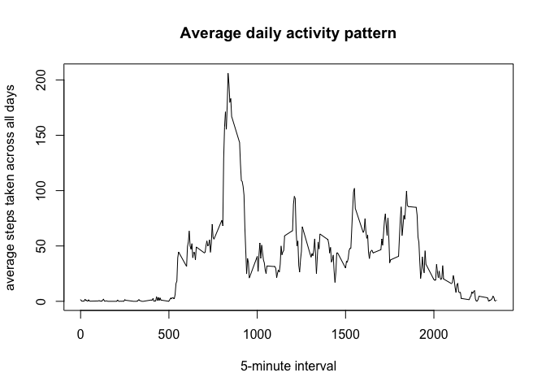
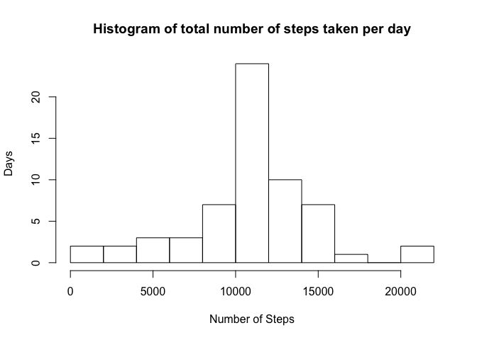
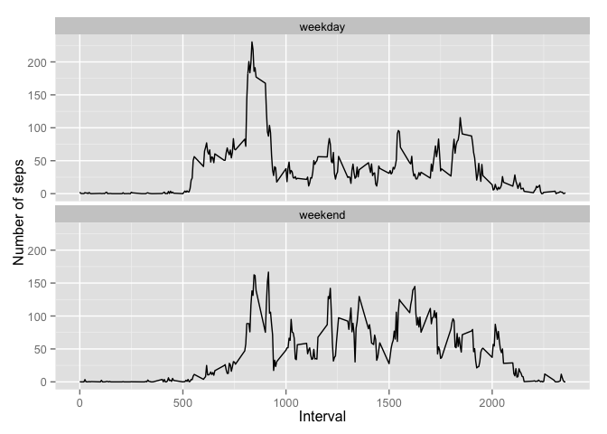

# Reproducible Research: Peer Assessment 1


## Loading and preprocessing the data
Read the activity.csv file

```r
activity <- read.csv("activity.csv")
```


## What is mean total number of steps taken per day?

For this part of the assignment, you can ignore the missing values in
the dataset.

1. Make a histogram of the total number of steps taken each day

First aggregate total number of steps taken per day and remove missing values

```r
bydate <- aggregate(activity$steps, by=list(activity$date), FUN=sum)
names(bydate)
```

```
## [1] "Group.1" "x"
```

```r
bydate$x <- as.numeric(bydate$x)
bydate <- na.omit(bydate)
```
Plot a histogram of the total number of steps taken per day

```r
hist(bydate$x, breaks=(by=10), xlab="Number of Steps", ylab="Days", main="Histogram of number of steps taken per day")
```

 


2. Calculate and report the **mean** and **median** total number of steps taken per day


```r
meanSteps <- mean(bydate$x)
meanSteps
```

```
## [1] 10766.19
```

```r
medianSteps <- median(bydate$x)
medianSteps
```

```
## [1] 10765
```

## What is the average daily activity pattern?
1. Make a time series plot (i.e. `type = "l"`) of the 5-minute interval (x-axis) and the average number of steps taken, averaged across all days (y-axis)


```r
activity_withoutNA <- na.omit(activity)
avgInt <- aggregate(activity_withoutNA$steps, by=list(activity_withoutNA$interval), FUN=mean)
names(avgInt)
```

```
## [1] "Group.1" "x"
```

```r
plot(avgInt$Group.1, avgInt$x, type="l", xlab="5-minute interval", ylab="average steps taken across all days", main="Average daily activity pattern")
```

 

2. Which 5-minute interval, on average across all the days in the dataset, contains the maximum number of steps?

Print row corresponding to the max and also extract the 5 minute interval for the max

```r
# print max and the corresponding 5 minute interval
avgInt[avgInt$x == max(avgInt$x),]
```

```
##     Group.1        x
## 104     835 206.1698
```

```r
# extract the 5 minute interval for the max
avgInt[avgInt$x == max(avgInt$x),1]
```

```
## [1] 835
```


## Imputing missing values
Note that there are a number of days/intervals where there are missing
values (coded as `NA`). The presence of missing days may introduce
bias into some calculations or summaries of the data.

1. Calculate and report the total number of missing values in the dataset (i.e. the total number of rows with `NA`s)


```r
numNA <- is.na(activity$steps)
sum(numNA)
```

```
## [1] 2304
```

2. Devise a strategy for filling in all of the missing values in the dataset. The strategy does not need to be sophisticated. For example, you could use the mean/median for that day, or the mean for that 5-minute interval, etc.

Strategy used: For each missing value replace with the mean for that 5-minute interval and round it to the nearest integer.

```r
#copy activity to a new data frame act
fixedAct <- activity

#extract the NA logical array for steps from activity
isNA <- is.na(activity$steps)

#append a new column to fixedAct denoting the interval index

#number of rows in activity
rows <- nrow(activity)

#number of intervals
intRows <- nrow(avgInt)

#use modulus to compute the interval indeces
fixedAct$intIndex <- ((seq(rows)-1) %% intRows) + 1

#create an array of interval indeces with missing values
missingIndices <- fixedAct$intIndex[isNA]

#obtain the corresponding average value for this missing interval from avgInt
missingValues <- avgInt[missingIndices,2]
```

3. Create a new dataset that is equal to the original dataset but with the missing data filled in.

fixedAct is the new dataset created with the imputed values.

```r
#copy the missing values to replace the NA's for the missing indices in fixedAct
#round the average to nearest integer
fixedAct$steps[isNA] <- round(missingValues) 
```


4. Make a histogram of the total number of steps taken each day and Calculate and report the **mean** and **median** total number of steps taken per day. Do these values differ from the estimates from the first part of the assignment? What is the impact of imputing missing data on the estimates of the total daily number of steps?


```r
# calculate total number of steps taken each day from the fixedAct
totalSteps <- aggregate(fixedAct$steps, by=list(fixedAct$date), FUN=sum)

#plot a histogram
hist(totalSteps$x, breaks=(by=10), xlab="Number of Steps", ylab="Days", main="Histogram of total number of steps taken per day")
```

 

Displaying the imputed mean and median

```r
imputedMean <- mean(totalSteps$x)
imputedMean
```

```
## [1] 10765.64
```

```r
imputedMedian <- median(totalSteps$x)
imputedMedian
```

```
## [1] 10762
```

Displaying the change in the mean and median values.

```r
imputedMean - meanSteps
```

```
## [1] -0.549335
```

```r
imputedMedian - medianSteps
```

```
## [1] -3
```

## Are there differences in activity patterns between weekdays and weekends?
For this part the `weekdays()` function may be of some help here. Use
the dataset with the filled-in missing values for this part.

1. Create a new factor variable in the dataset with two levels -- "weekday" and "weekend" indicating whether a given date is a weekday or weekend day.


```r
#convert date column from factor type to date type
fixedAct$date <- as.Date(fixedAct$date)

#append a new column wd containing the weekday
fixedAct$wd <- weekdays(fixedAct$date)
fixedAct$wd <- ifelse(fixedAct$wd %in% c("Saturday","Sunday"),"weekend","weekday")
```

2. Make a panel plot containing a time series plot (i.e. `type = "l"`) of the 5-minute interval (x-axis) and the average number of steps taken, averaged across all weekday days or weekend days (y-axis). The plot should look something like the following, which was created using **simulated data**:

Extract and calculate the average number of steps taken across all weekday and all weekends.


```r
# extract weekend data
weekend_Act <- fixedAct[fixedAct$wd=="weekend",]
avgInt_weekend <- aggregate(weekend_Act$steps, by=list(weekend_Act$interval), FUN=mean)
```


```r
# extract weekday data
weekday_Act <- fixedAct[fixedAct$wd=="weekday",]
avgInt_weekday <- aggregate(weekday_Act$steps, by=list(weekday_Act$interval), FUN=mean)
```

Combine the averages using rbind and using ggplot make a lattice plot.

```r
#combine the averages using rbind
avgInt_weekend$wd <- "weekend"
avgInt_weekday$wd <- "weekday"
avgWD <- rbind(avgInt_weekday,avgInt_weekend)

#plot using ggplot
library(ggplot2)
g <- ggplot(avgWD, aes(x=Group.1,y=x)) + geom_line()
# arrange grid in vertical direction
g + facet_wrap(~wd, ncol=1) + labs(x="Interval") + labs(y="Number of steps")
```

 
